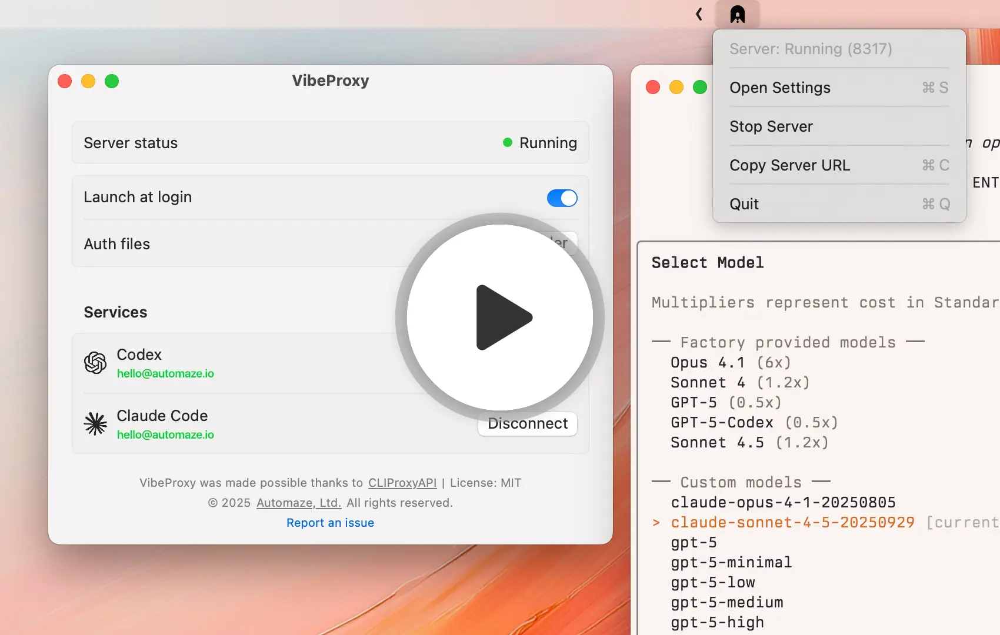

# VibeProxy

<p align="center">
  
</p>

<p align="center">
<a href="https://automaze.io" rel="nofollow"></a>
<a href="https://github.com/automazeio/vibeproxy/blob/main/LICENSE"></a>
<a href="http://x.com/intent/follow?screen_name=aroussi" rel="nofollow"></a>
<a href="https://github.com/automazeio/vibeproxy"></a></p>
</p>

**Stop paying twice for AI.** VibeProxy is a beautiful native macOS menu bar app that lets you use your existing Claude Code, ChatGPT, **Gemini**, **Kimi**, **Qwen**, **Antigravity**, **Grok Build**, and **Z.AI GLM** subscriptions with powerful AI coding tools like **[Factory Droids](https://app.factory.ai/r/FM8BJHFQ)**.

Built on [CLIProxyAPI](https://github.com/router-for-me/CLIProxyAPI), it handles OAuth authentication, token management, and API routing automatically. One click to authenticate, zero friction to code.


<p align="center">
<br>
  <a href="https://www.loom.com/share/5cf54acfc55049afba725ab443dd3777"></a>
</p>

> [!TIP]
> 📣 **NEW: Vercel AI Gateway Integration!**<br>Route your Claude requests through [Vercel's officially sanctioned AI Gateway](https://vercel.com/docs/ai-gateway) for safer access to your Claude Max subscription. No more worrying about account risks from using OAuth tokens directly!
>
> **Latest models supported:** Gemini 3 Pro (via Antigravity), GPT-5.1 / GPT-5.1 Codex, Claude Sonnet 4.5 / Opus 4.5 with extended thinking, GitHub Copilot, Grok, Z.AI GLM-4.7, and Kimi! 🚀
> 
> **Setup Guides:**
> - [Factory CLI Setup →](FACTORY_SETUP.md) - Use Factory Droids with your AI subscriptions
> - [Amp CLI Setup →](AMPCODE_SETUP.md) - Use Amp CLI with fallback to your subscriptions

---

## Features

- 🎯 **Native macOS Experience** - Clean, native SwiftUI interface that feels right at home on macOS
- 🚀 **One-Click Server Management** - Start/stop the proxy server from your menu bar
- 🔐 **Easy Authentication** - Authenticate with Codex, Claude Code, Gemini, Kimi, Qwen, Antigravity, and xAI/Grok (OAuth), plus Z.AI GLM (API key) directly from the app
- 🛡️ **Vercel AI Gateway** - Route Claude requests through [Vercel's AI Gateway](https://vercel.com/docs/ai-gateway) for safer access to your Claude Max subscription without risking your account from direct OAuth token usage
- 👥 **Multi-Account Support** - Connect multiple accounts per provider with automatic round-robin distribution and failover when rate-limited
- 🎚️ **Provider Priority** - Enable/disable providers to control which models are available (instant hot reload)
- 📊 **Real-Time Status** - Live connection status and automatic credential detection
- 🔄 **Automatic App Updates** - Starting with v1.6, VibeProxy checks for updates daily and installs them seamlessly via Sparkle
- 🎨 **Beautiful Icons** - Custom icons with dark mode support
- 💾 **Self-Contained** - Everything bundled inside the .app (server binary, config, static files)


## Installation

**Requirements:** macOS 13+ (Ventura or later)

### Download Pre-built Release (Recommended)

1. Go to the [**Releases**](https://github.com/automazeio/vibeproxy/releases) page
2. Download the appropriate version for your Mac:
   - **Apple Silicon** (M1/M2/M3/M4): `VibeProxy-arm64.zip`
   - **Intel**: `VibeProxy-x86_64.zip` *(untested - please report issues)*
3. Extract and drag `VibeProxy.app` to `/Applications`
4. Launch VibeProxy

**Code Signed & Notarized** ✅ - No Gatekeeper warnings, installs seamlessly on macOS.

### Build from Source

Want to build it yourself? See [**INSTALLATION.md**](INSTALLATION.md) for detailed build instructions.

## Usage

### First Launch

1. Launch VibeProxy - you'll see a menu bar icon
2. Click the icon and select "Open Settings"
3. The server will start automatically
4. Click "Add Account" for Claude Code, Codex, Gemini, Kimi, Qwen, Antigravity, or Z.AI GLM; click "Sign In" for xAI/Grok

### Authentication

When you add an OAuth account:
1. Your browser opens with the OAuth page
2. Complete the authentication in the browser
3. VibeProxy automatically detects your credentials
4. Status updates to show you're connected

### Grok Build (OAuth)

1. Use an xAI account with **Grok Build access**. Model availability and usage limits depend on your account; an API key or access to web chat alone does not establish Build eligibility.
2. In Settings, click **Sign In** beside **Grok Build (OAuth)**.
3. Complete sign-in in the browser. The sheet shows the verification link and device code, with **Open Browser** and **Copy Code** controls if needed.
4. Wait for **Connected as …**. You can cancel or retry an expired/denied sign-in from the sheet.

Credentials are saved in `~/.cli-proxy-api/` and refreshed by the bundled CLIProxyAPI. Existing xAI credential files are detected automatically. Account removal and enable/disable controls work like the other OAuth providers. Custom API-key providers named `xai` remain separate and retain their own enabled state.

The stock backend routes OAuth HTTP chat to Grok Build by default. VibeProxy preserves explicit upstream credential/configuration overrides. This integration covers HTTP Chat Completions and Responses, including streaming and coding tools; it does not add Grok CLI client configuration or WebSocket support.

Discover available model IDs through the public proxy port (requires `curl` and `jq`):

```sh
# Use your configured local proxy API key if one is required.
export VIBEPROXY_API_KEY="dummy-not-used"
curl -fsS http://localhost:8317/v1/models \
  -H "Authorization: Bearer $VIBEPROXY_API_KEY" | jq -r '.data[].id'
```

Choose a Grok text model returned by that command. The catalog may include `grok-4.6`, `grok-4.5`, or `grok-build-0.1`; listing a model does not guarantee your account is entitled to use it. For Factory Droid, add an entry to `custom_models` in `~/.factory/config.json`, following [Factory setup](FACTORY_SETUP.md):

```json
{
  "model_display_name": "Grok Build",
  "model": "REPLACE_WITH_DISCOVERED_GROK_MODEL_ID",
  "base_url": "http://localhost:8317/v1",
  "api_key": "dummy-not-used",
  "provider": "generic-chat-completion-api"
}
```

Replace the model placeholder with the exact discovered ID and the API key with your local proxy key if configured. No xAI API key is needed for this OAuth service.

When you click "Add Account" for Z.AI GLM:
1. Paste your provider API key
2. VibeProxy stores it in `~/.cli-proxy-api/`
3. The provider becomes available through the proxy immediately

### Server Management

- **Toggle Server**: Click the status (Running/Stopped) to start/stop
- **Menu Bar Icon**: Shows active/inactive state
- **Launch at Login**: Toggle to start VibeProxy automatically

## Requirements

- macOS 13.0 (Ventura) or later

## Development

### Project Structure

```
VibeProxy/
├── Sources/
│   ├── main.swift              # App entry point
│   ├── AppDelegate.swift       # Menu bar & window management
│   ├── ServerManager.swift     # Server process control & auth
│   ├── SettingsView.swift      # Main UI
│   ├── AuthStatus.swift        # Auth file monitoring
│   └── Resources/
│       ├── AppIcon.iconset     # App icon
│       ├── AppIcon.icns        # App icon
│       ├── cli-proxy-api-plus  # CLIProxyAPI binary
│       ├── config.yaml         # CLIProxyAPI config
│       ├── icon-active.png     # Menu bar icon (active)
│       ├── icon-inactive.png   # Menu bar icon (inactive)
│       ├── icon-claude.png     # Claude Code service icon
│       ├── icon-codex.png      # Codex service icon
│       ├── icon-gemini.png     # Gemini service icon
│       ├── icon-qwen.png       # Qwen service icon
│       ├── icon-xai.png        # xAI/Grok service icon
│       └── icon-zai.png        # Z.AI GLM service icon
├── Package.swift               # Swift Package Manager config
├── Info.plist                  # macOS app metadata
├── build.sh                    # Resource bundling script
├── create-app-bundle.sh        # App bundle creation script
└── Makefile                    # Build automation
```

### Key Components

- **AppDelegate**: Manages the menu bar item and settings window lifecycle
- **ServerManager**: Controls the cli-proxy-api server process and OAuth authentication
- **SettingsView**: SwiftUI interface with native macOS design
- **AuthStatus**: Monitors `~/.cli-proxy-api/` for authentication files
- **File Monitoring**: Real-time updates when auth files are added/removed

## Credits

VibeProxy is built on top of [CLIProxyAPI](https://github.com/router-for-me/CLIProxyAPI), an excellent unified proxy server for AI services with support for third-party providers.

Special thanks to the CLIProxyAPI project for providing the core functionality that makes VibeProxy possible.

## License

MIT License - see LICENSE file for details

## Support

- **Report Issues**: [GitHub Issues](https://github.com/automazeio/vibeproxy/issues)
- **Website**: [automaze.io](https://automaze.io)

---

© 2025 [Automaze, Ltd.](https://automaze.io) All rights reserved.
